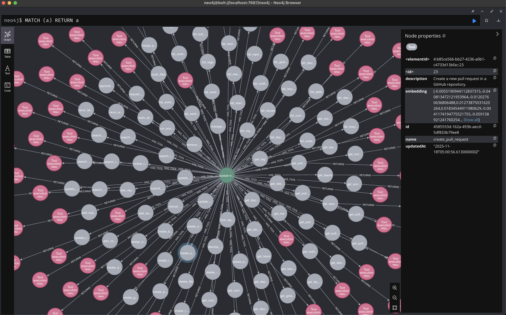

# MCP RAG GitHub Example

<p align="center">
  
</p>

This example demonstrates how to use MCP RAG with the GitHub MCP server to intelligently select relevant tools based on your prompts.

## What This Does

This example demonstrates the tool selection capabilities of MCP RAG by loading and mocking the GitHub MCP server's 93 tools (without actually connecting to GitHub). It uses vector similarity search to automatically select only the most relevant tools for your query. Instead of overwhelming the LLM with all available tools, it picks the top 10 most relevant ones based on semantic similarity.

**Note**: This is a demonstration of the RAG tool selection mechanism. The GitHub tools are mocked with their response types - no actual GitHub API calls are made. This allows you to see how MCP RAG intelligently selects tools without needing GitHub API access.

## Prerequisites

- Node.js 18+ and pnpm installed
- OpenAI API key
- Neo4j database (local or remote)

## Getting Started

### 1. Install the Monorepo

From the root of the monorepo:

```bash
pnpm install
```

This will install all dependencies for all packages in the monorepo.

### 2. Start Neo4j

The easiest way is to use Docker Compose from the monorepo root:

```bash
docker compose up
```

This will start a Neo4j instance on `localhost:7687` with the credentials:

- Username: `neo4j`
- Password: `password`

Alternatively, you can use a local Neo4j installation or a cloud instance. Just make sure to update the connection details in your environment variables.

### 3. Set Environment Variables

Create a `.env` file in the `examples/github` directory:

```bash
OPENAI_API_KEY=your_openai_api_key_here

# Neo4j connection (optional if using docker-compose defaults)
NEO4J_URI=bolt://localhost:7687
NEO4J_USERNAME=neo4j
NEO4J_PASSWORD=password
```

### 4. Run the Example

Navigate to the GitHub example directory and start it with debug logging enabled:

```bash
cd examples/github
DEBUG=@mcp-rag/* pnpm start
```

This will run the example with detailed debug output showing the tool selection process.

### Example Output

```bash
  @mcp-rag/client:tools Prompt: "Get the contents of the README.md file from the main branch in rocket-connect/mcp-rag" +9s
  @mcp-rag/client:embeddings Generating embedding for prompt +2s
  @mcp-rag/client:neo4j Executing vector search +3s
  @mcp-rag/client Selected 10 tools +439ms
  @mcp-rag/client:tools Selected tools: [
  @mcp-rag/client:tools   'get_file_contents',
  @mcp-rag/client:tools   'get_commit',
  @mcp-rag/client:tools   'star_repository',
  @mcp-rag/client:tools   'get_release_by_tag',
  @mcp-rag/client:tools   'create_branch',
  @mcp-rag/client:tools   'get_dependabot_alert',
  @mcp-rag/client:tools   'list_branches',
  @mcp-rag/client:tools   'get_latest_release',
  @mcp-rag/client:tools   'get_tag',
  @mcp-rag/client:tools   'list_releases'
  @mcp-rag/client:tools ] +439ms
  @mcp-rag/client:tools Tool "get_file_contents" relevance: 0.7486791610717773 +0ms
  @mcp-rag/client:tools Tool "get_commit" relevance: 0.7028169631958008 +0ms

📊 Results:
================================================================================

📝 Generated Text:


🛠️  Tool Calls:

  1. get_file_contents
     Input: {
  "owner": "rocket-connect",
  "repo": "mcp-rag",
  "path": "README.md",
  "ref": "main"
}

📈 Usage Stats:
  Input Tokens: 762
  Output Tokens: 33
  Total Tokens: 795
================================================================================
```

**Try it yourself!** Edit the prompt in `src/index.ts` to see how different queries select different tools. For example:

- "Create a new issue about documentation" → will select `create_issue` and related tools
- "List all pull requests" → will select `list_pull_requests` and PR-related tools
- "Get workflow run logs" → will select workflow and CI/CD related tools

## What to Expect

When you run the example, you'll see:

1. **Connection to Neo4j** - The client connects to your Neo4j database
2. **MCP Server Discovery** - It loads and mocks all 93 tools from the GitHub MCP server specification
3. **Tool Embedding Generation** - Creates vector embeddings for each tool (cached after first run)
4. **Prompt Execution** - Runs an example prompt: "Get the contents of the README.md file from the main branch in rocket-connect/mcp-rag"
5. **Tool Selection** - Shows which tools were selected based on semantic similarity:
   - `get_file_contents` (highest relevance: ~0.75)
   - `get_commit` (relevance: ~0.70)
   - And 8 other relevant tools
6. **Tool Execution** - The LLM identifies the most appropriate tool (`get_file_contents`) to call
7. **Results** - Displays the generated text, tool calls, and token usage

**Note**: The tools are mocked, so you'll see the tool selection and LLM decision-making process, but no actual GitHub API calls are made.

## How It Works

1. **Sync Phase**: All 93 GitHub MCP tools are loaded with mocked response types and synced to Neo4j with their embeddings
2. **Query Phase**: When you provide a prompt, it's converted to a vector embedding
3. **Search Phase**: Vector similarity search finds the top 10 most relevant tools
4. **Generation Phase**: Only the relevant tools are provided to the LLM for generation
5. **Execution Phase**: The LLM intelligently chooses the appropriate tool(s) to call (mocked execution)

## Customization

You can modify `src/index.ts` to:

- Change the example prompt
- Adjust the number of tools selected (default: 10)
- Modify the minimum relevance score threshold
- Add multiple prompts to test different scenarios

## Troubleshooting

- **Neo4j connection failed**: Make sure Neo4j is running and credentials are correct
- **OpenAI API errors**: Verify your API key is valid and has sufficient credits
- **Tool sync taking long**: First run takes longer as it generates embeddings for all 93 tools
